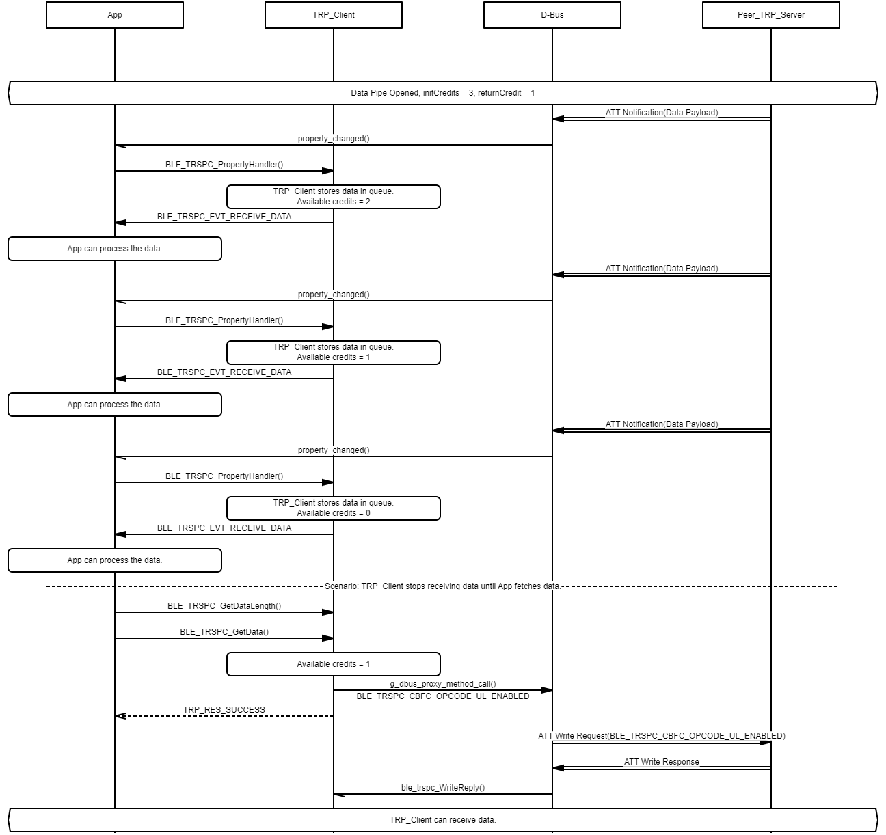

# Transparent profile message sequence charts

## Transparent Profile Client Role Initialization and Connection Establishment Procedure

- Example of Transparent Profile Client Role Initialization 

- Example of Opening Transparent Profile Client Role Control Pipe 

- Example of Opening Transparent Profile Client Role Data Pipe 

## Transparent Profile Server Role Initialization and Connection Establishment Procedure	

- Example of Transparent Profile Server Role Initialization 

- Example of Opening Transparent Profile Server Role Control Pipe 

- Example of Opening Transparent Profile Server Role Data Pipe 

## Transparent Profile Vendor Command Exchange Procedure

- Example of Transparent Profile Client Role Vendor Command Exchange Over Control Pipe 

- Example of Transparent Profile Server Role Vendor Command Exchange Over Control Pipe 

## Transparent Profile Data Exchange Procedure - Client Role

- Example of Transparent Profile Client Role Data Exchange Over Data Pipe - The data is transmitted from a Client Role 

- Example of Transparent Profile Client Role Data Exchange Over Data Pipe - The data is transmitted from a Server Role 

## Transparent Profile Data Exchange Procedure - Server Role

- Example of Transparent Profile Server Role Data Exchange Over Data Pipe - The data is transmitted from a Server Role 

- Example of Transparent Profile Server Role Data Exchange Over Data Pipe - The data is transmitted from a Client Role 
